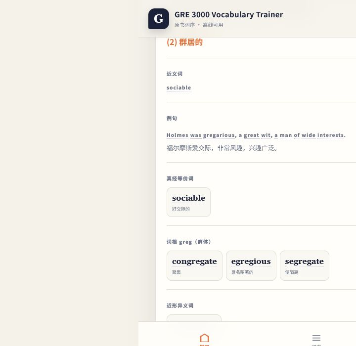
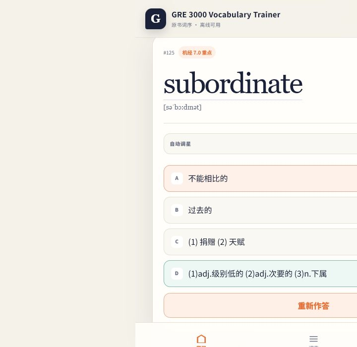

# GRE 3000 Vocabulary Trainer

<p align="center">
  按原书 List 顺序学习 GRE 词汇，支持 Windows、iPhone、离线使用与免账号加密同步。
</p>

<p align="center">
  
  
  
  
</p>

<p align="center">
  <a href="https://github.com/KumamuKuma/gre-3000-offline/releases/latest"><strong>下载 Windows 版</strong></a>
  ·
  <a href="https://gre-3000-offline.cbg206.chatgpt.site"><strong>打开网页版 / iPhone 版</strong></a>
</p>


## 这是什么

GRE 3000 Vocabulary Trainer 是一款围绕原书词序设计的个人背词工具。它把 List、多星级筛选、四种学习模式、机经重点、等价词、同词根词和近形异义词集中在同一条学习路径中。

- **3,292 个词条**，按原书 List 顺序排列
- **Windows 单文件 EXE**，无需安装
- **iPhone / iPad PWA**，可添加到主屏幕
- **四种学习模式**：阅读、简义、回忆、四选一
- **0–3 星标注**，支持多 List 与多星级组合学习
- **免账号同步码**，在设备端加密个人进度
- **离线词典与点词查询**，例句、释义中的英文均可点击

## 界面预览

<table>
  <tr>
    <td width="50%">
      
      <br><sub>等价词与同词根词集中展示</sub>
    </td>
    <td width="50%">
      
      <br><sub>四选一答错后显示正确词性，并可重新作答</sub>
    </td>
  </tr>
</table>

<p align="center">
  
  <br><sub>iPhone 竖屏界面，可从 Safari 添加到主屏幕</sub>
</p>

## Windows：三步开始

### 1. 下载

打开 [Releases](https://github.com/KumamuKuma/gre-3000-offline/releases/latest)，下载：

```text
GRE-3000-Vocabulary-Trainer-Windows.exe
```

这是单文件版本，可以放在任意文件夹中直接运行。更新时关闭旧版本，用新 EXE 替换即可，个人进度不会随 EXE 被覆盖。

### 2. 首次启动

双击 EXE。由于当前是未购买商业代码签名证书的个人构建，Windows SmartScreen 可能显示“Windows 已保护你的电脑”。请先确认文件来自本仓库的 Release，再选择“更多信息”→“仍要运行”。

如果需要核对文件，可在 Release 页面查看 SHA-256，并在 PowerShell 中运行：

```powershell
Get-FileHash -Algorithm SHA256 ".\GRE-3000-Vocabulary-Trainer-Windows.exe"
```

### 3. 开始学习

1. 在首页选择 List：可以选择一个、多个或全部 List。
2. 选择“全部星级”，或同时选择多个星级，例如 1 星和 2 星。
3. 选择学习模式，然后点击“开始学习”。
4. 用上一词、下一词按原书顺序学习；也可以一键到当前所选学习范围的开头或结尾。
5. 点击学习卡片右上角的星星，在 0、1、2、3 星之间循环标注。
6. 选择“全部星级”时，完整走到所选范围最后一个词后才可点击“完成本轮”；本轮所选的每个 List 都会增加一次已背次数。使用星级筛选学习时不会增加 List 完成轮次。

## iPhone / iPad：安装到主屏幕

Windows EXE 不能直接安装到 iPhone。iPhone 使用的是配套的 PWA 网页版：

**正式网址：<https://gre-3000-offline.cbg206.chatgpt.site>**

1. 用 Safari 打开上面的正式网址。
2. 等待首页和词库完整加载。
3. 点击 Safari 底部的“分享”按钮。
4. 选择“添加到主屏幕”。
5. 以后从主屏幕图标打开，就可以像普通 App 一样使用。

首次完整加载需要联网。加载完成后，核心学习、词库和本地进度支持离线使用。为防止 Safari 清理网站数据，建议启用同步码或定期导出 JSON 进度文件。

## 四种学习模式

| 模式 | 显示方式 | 适合场景 |
| --- | --- | --- |
| 阅读 | 直接显示完整释义、词性、例句与词汇关系 | 初次学习 |
| 简义模式 | 直接显示简约词义，无需点击揭晓 | 快速过词 |
| 回忆 | 先隐藏释义，点击或按空格后揭晓 | 主动回忆 |
| 四选一 | 从四个词义中选择正确答案 | 自测巩固 |

四选一模式中：

- 正确选项的每条中文词义都会显示对应词性。
- 答对后会显示词性、完整词义和例句。
- 答错后会标出正确答案，并提供“重新作答”。
- 可以开启“答错自动加 1 星”和“答对自动减 1 星”。
- 每道题只按**第一次作答**调整星级，重新作答不会重复加星或减星。

## 主要功能

### 学习范围与进度

- List 1–30 与补充 List 均可单选、多选或全选。
- 多个 List 合并后仍保持原书顺序，不提供随机打乱。
- 按星级学习时，单词可标为 0、1、2 或 3 星，并可同时筛选多个星级。
- 每个 List 只记录完成轮次；单词熟悉程度由星级表示。
- 学习位置自动保存，可以从上次位置继续。
- 完整词表支持搜索、查看所属 List、检查重点标记并直接调整星级。

### 词汇信息

- 四选一作答后，正确选项的每条中文词义前分别显示对应词性。
- 同时出现在《GRE 镇考机经词 7.0》中的词会显示橙色重点标记。
- 展示《真经 GRE 等价词汇总》中的等价词，并支持双向对应。
- 展示经过审核的同词根词、同族词，以及拼写相近但意思不同的近形异义词。
- 英文释义、例句与词汇关系中的英文可以点击查询。
- 内置精简 ECDICT 英汉词典，断网时也可查询常见词形和词组。
- 可选中英文词组或句子，再主动发起联网翻译。

### 朗读与翻页

- 单词与完整英文例句均可朗读。
- Windows 主音源使用本机英文语音，可离线工作。
- Windows 备用音源使用微软在线自然语音，需要联网。
- 可以开启“切换到下一词时自动朗读一次”。
- 电脑支持方向键翻页，手机支持左右滑动翻页。

### Windows 快捷键

| 快捷键 | 功能 |
| --- | --- |
| `Ctrl+F` | 返回首页并聚焦“快速查词”搜索框 |
| `←` / `→` | 上一词 / 下一词 |
| `Space` | 在回忆模式中显示或隐藏答案 |
| `P` | 用主音源朗读当前单词 |

在搜索框等可编辑控件中输入时，学习快捷键不会抢占输入。

## 免账号同步码

同步不需要 GPT、Apple、GitHub 或其他账号。同步码同时承担身份验证和解密钥匙的作用，个人进度会在设备端使用 **AES-256-GCM** 加密。服务器不保存明文进度，只保存加密进度及同步所需的哈希、随机数和时间戳等技术元数据。

### 推荐同步流程

1. 在拥有最新进度的设备上创建或连接同步码。
2. 如果最新进度在 Windows，先点击“上传本机进度”。
3. 在另一台设备输入同一个 `GRE1-` 开头的同步码。
4. Windows 端点击“从云端恢复”；网页版连接后会读取云端进度。
5. 确认 List 位置、完成轮次和星级已经更新后再继续学习。

### Windows 与网页版的差别

| 设备 | 同步行为 |
| --- | --- |
| Windows | 明确点击“上传本机进度”或“从云端恢复” |
| 网页版 / iPhone | 本地变化会在短暂防抖后自动上传；重新连接时读取云端 |

同步不是逐字段实时合并。两台设备同时修改时，最后一次成功上传的完整进度可能覆盖前一次，因此建议在切换设备前先完成一次同步，不要同时在两端学习。

同步码无法由服务器找回。请勿公开，并建议另存一份到自己的密码管理器。也可以完全不用云同步，改用“导出进度 / 导入进度”传递 JSON 文件。

## 哪些功能可以离线

| 功能 | Windows | 网页版 / iPhone |
| --- | --- | --- |
| 核心学习、List、星级、完成轮次 | 可离线 | 首次加载后可离线 |
| 内置词典与点词查询 | 可离线 | 首次缓存后可离线 |
| Windows 主音源 | 可离线 | 不适用 |
| 备用自然语音 | 需要联网 | 取决于浏览器语音服务 |
| 免账号云同步 | 需要联网 | 需要联网 |
| 主动联网翻译 | 需要联网 | 需要联网 |

## 数据保存与备份

Windows 学习进度、List 完成次数、星级和设置保存在：

```text
%APPDATA%\GRE Vocab Offline\GRE 3000 词离线版\user.db
```

虽然产品已经改名为 GRE 3000 Vocabulary Trainer，数据目录仍有意沿用旧名称，以确保升级后可以继续读取原有进度。

运行日志位于同一目录下：

```text
logs\app.log
```

备份数据库前请完全退出程序，再复制 `user.db`。删除整个数据目录会重置 Windows 端个人数据。

网页版进度保存在当前浏览器的网站数据中。清除 Safari 或浏览器的网站数据可能删除本地进度，因此建议保留同步码或定期导出 JSON。

## 隐私说明

- 词库与个人进度默认保存在本机。
- 云同步不上传明文进度；云端保存加密进度及同步所需的哈希、随机数和时间戳等技术元数据。
- 使用 Windows 备用自然语音时，待朗读文字会发送给微软在线语音服务。
- 只有主动点击“联网翻译”时，选中的文字才会发送给 MyMemory 翻译服务。
- 原始参考 PDF、Windows 个人数据库和用户导出的进度文件不会提交到本仓库。

## 常见问题

<details>
<summary><strong>为什么同步完成后另一台设备没有变化？</strong></summary>

先确认拥有最新进度的设备已经完成上传。Windows 生成同步码本身不等于上传进度，还需要点击“上传本机进度”；另一端随后再读取云端。若两端都在学习，以最后成功上传的完整进度为准。
</details>

<details>
<summary><strong>为什么备用音源没有声音？</strong></summary>

备用音源需要联网。请先检查网络，再在设置中试听并确认 Windows 原生音频输出设备可用。断网学习时请选择主音源。
</details>

<details>
<summary><strong>为什么改名后数据文件夹还是“GRE 3000 词离线版”？</strong></summary>

这是兼容设计。保留旧目录可以让新版自动读取已经积累的星级、轮次和设置，避免改名导致“进度消失”。
</details>

<details>
<summary><strong>Windows EXE 校验值是什么？</strong></summary>

SHA-256 是文件的数字指纹，用于确认下载文件与发布文件完全一致。它不是密码，也不会影响程序使用。
</details>

## 开发与构建

桌面端使用 Python 3.12、PySide6 和 SQLite；网页版使用 Next.js。

```powershell
python -m venv .venv
.\.venv\Scripts\python.exe -m pip install -e ".[dev]"
$env:QT_QPA_PLATFORM = "offscreen"
.\.venv\Scripts\python.exe -m pytest -v -p no:cacheprovider
```

重新生成词库时，需要通过环境变量提供三份合法取得的参考 PDF：

```powershell
$env:GRE_SOURCE_PDF = "<张巍 GRE 镇考 3000 词 PDF 路径>"
$env:GRE_EQUIVALENCE_PDF = "<真经 GRE 等价词汇总 PDF 路径>"
$env:GRE_MACHINE7_PDF = "<GRE 镇考机经词 7.0 PDF 路径>"
```

构建 Windows 单文件版本：

```powershell
powershell -ExecutionPolicy Bypass -File scripts/build_release.ps1 `
  -OutputDirectory build/release-output
```

发布脚本会依次执行全量测试、严格词库导入、数据库与审计核对、图标生成、单文件构建和原生窗口启动检查。

## 当前词库数据

- 3,292 个词条
- 32 个 List（List 1–30 与 2 个补充 List）
- 547 条有原书直接来源的等价词关系
- 1,410 个机经 7.0 重点词
- 203 条已人工复核记录
- SQLite 完整性检查：`ok`

## 数据与许可边界

普通英文点词查询使用 [ECDICT](https://github.com/skywind3000/ECDICT) 的精简子集。ECDICT 以 MIT 许可证发布，许可证全文位于 `resources/ECDICT-LICENSE.txt`。

本仓库没有为全部项目内容声明统一的开源许可证。原始参考 PDF 与个人进度不随源代码发布；请仅使用自己合法取得的学习资料。网页版包含运行所需的导出词库数据，使用或再分发时请自行确认相关内容的权利边界。
